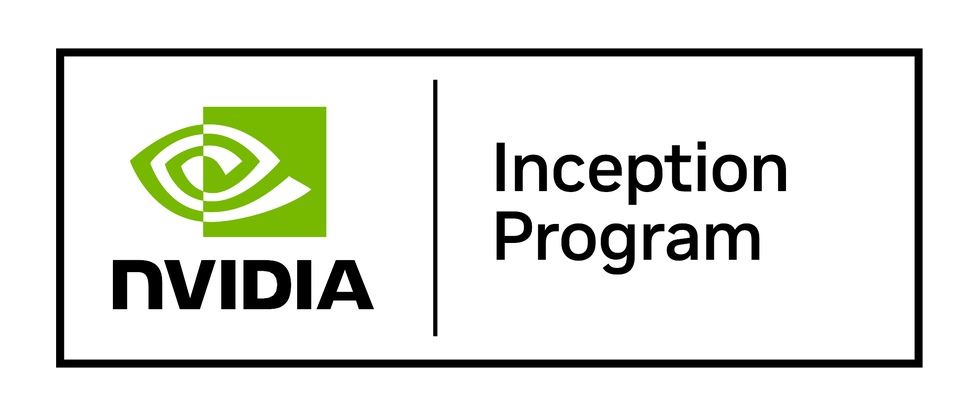
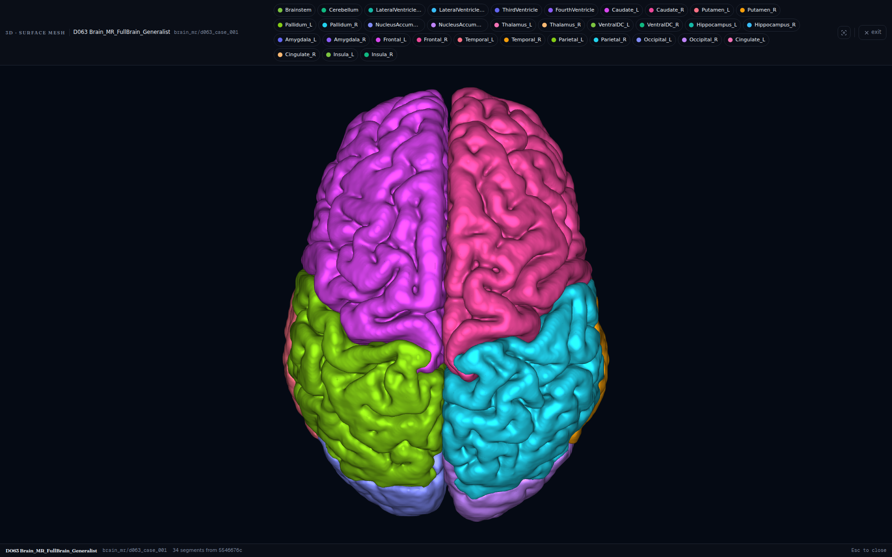
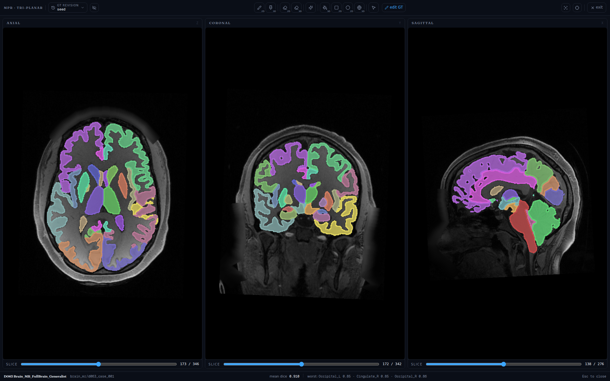
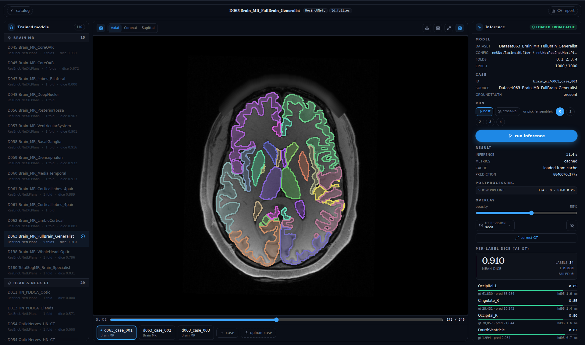
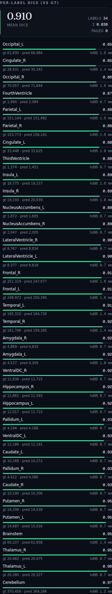
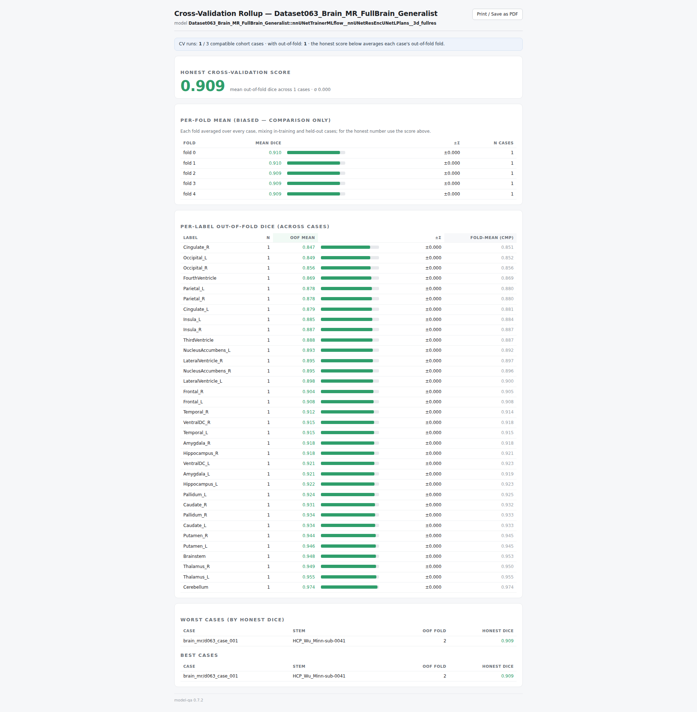
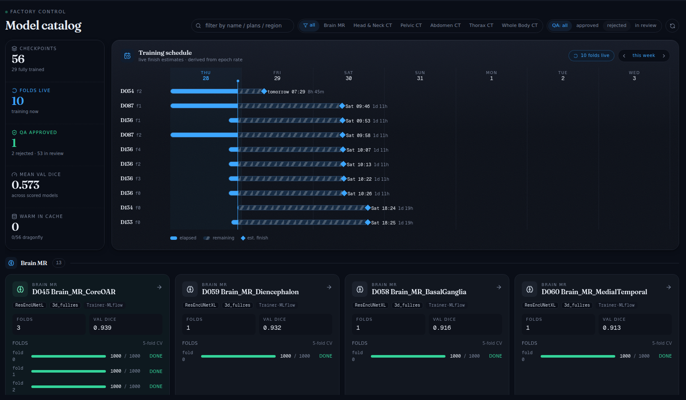

<div align="center">

<picture>
  <source media="(prefers-color-scheme: dark)" srcset="docs/images/brand/rtmedical-logo-white.svg">
  
</picture>

<br/><br/>

# model-factory

**A scalable, Kubernetes-native training factory for medical-image segmentation.**

Convert → preprocess → train → track → QA — the whole
[nnU-Net v2](https://github.com/MIC-DKFZ/nnUNet) /
[TotalSegmentator](https://github.com/wasserth/TotalSegmentator) lifecycle,
turned into a queued, multi-GPU pipeline you can stand up on *your* cluster.


<br/>

<!--
  Official NVIDIA Inception Program member badge (colored RGB "for-screen"
  variant), presented on a white card so its black keyline/text stay legible in
  GitHub dark mode, per NVIDIA's light-background guidance. Source SVG lives in
  docs/images/brand/nvidia-inception-program-badge.svg.
-->
<a href="https://www.nvidia.com/en-us/startups/">
  
</a>

*Developed using accelerated-computing infrastructure provided through the*
*[**NVIDIA Innovation Lab**](https://www.nvidia.com/en-us/data-center/innovation-lab/),*
*part of the [**NVIDIA Inception**](https://www.nvidia.com/en-us/startups/) program for startups.*

<br/>



<sub>The QA viewer's 3D surface-mesh view — a 34-structure whole-brain parcellation predicted by the
Brain-MR generalist model (Dataset063), rendered from the model's own output.</sub>

</div>

---

## Why model-factory

Training segmentation models at scale usually means re-inventing the same
plumbing by hand: dataset registration, GPU scheduling, experiment tracking, a
model registry, and *some* way to actually look at what the model predicts.
model-factory packages that plumbing so a radiotherapy / medical-imaging team can
go from a folder of DICOM/NIfTI to a QA-reviewed, registered model without
babysitting `kubectl`.

- **One config file, not a wiki page.** `cluster.yaml` declares your nodes, GPU
  layout, storage class, quotas, and image tags; a generator renders every
  manifest from it. Nothing site-specific is hardcoded.
- **MIG *and* whole-GPU.** A single switch pins one trainer per MIG slice on
  partitioned H100/A100s, or requests whole GPUs via the device plugin.
- **Queued, prioritized training.** Kueue admits jobs by priority so an
  interactive eval can preempt a hyper-parameter sweep; KubeRay fans 5-fold
  campaigns across the whole GPU pool.
- **Hard cases handled.** Drop-in trainers/planners for tiny/sparse structures,
  sub-voxel anatomy, and partial-label generalists — patterns that otherwise
  collapse to Dice 0.
- **QA you can actually see.** A web viewer renders each model's predictions
  against ground truth in 2D, tri-planar MPR, and 3D, with per-structure
  Dice/HD95, cross-validation reports, and accept/reject verdicts.
- **Lineage- & licensing-aware.** Every model is tagged with its base weights and
  dataset license, so you never accidentally ship a non-commercial fine-tune.

## Architecture

```
                 ┌──────────────────────────┐
   you  ──CLI──▶ │  modelfactory CLI / SDK  │  render Job manifests,
                 │  (k8s + MLflow clients)  │  apply via the k8s API
                 └────────────┬─────────────┘
                              ▼
   ┌──────────────── your Kubernetes cluster ─────────────────────┐
   │  Kueue ClusterQueue ─ priority-ordered GPU admission          │
   │  KubeRay RayCluster ─ one worker per MIG slice OR whole GPU   │
   │  nnU-Net trainers   ─ MLflow-logged, checkpointed to NFS/PVC  │
   │  MLflow + Postgres + MinIO ─ experiments, metrics, artifacts  │
   │  Prometheus + DCGM + Loki  ─ GPU + training observability     │
   │  QA viewer (FastAPI + Next.js) ─ Dice vs ground-truth, 3D     │
   └───────────────────────────────────────────────────────────────┘
```

---

## Features

### 1. Dataset conversion — bring your own format

A pluggable framework turns heterogeneous cohorts into clean nnU-Net datasets. A
`DatasetSpec` declares the anatomy, modality, and label map; a `DatasetSource`
adapter knows how to read a particular on-disk layout. Built-in adapters cover
**MSD, PDDCA, LUNA16, TotalSegmentator, BTCV, SegRAP, and clinical RTSTRUCT**,
and adding your own is one small class. Channel names and normalization are
derived from the spec's modality (CT vs. MR), so an MR cohort is z-scored, not
CT-windowed.

→ [`docs/conversion.md`](docs/conversion.md)

### 2. Automatic preprocessing

Each dataset is preprocessed by a one-off Kubernetes Job (CPU-only) that runs
nnU-Net's plan-and-preprocess and writes `plans.json` + preprocessed inputs to
shared storage — ready for any number of training folds to consume.

### 3. Queued, prioritized multi-GPU training

Kueue provides a ClusterQueue that admits training Jobs by **priority class**
(`interactive-eval` > `fold-training` > `hpo-sweep`), so evaluation and prep jobs
never get stuck behind a long sweep, and a sweep never preempts real training.
KubeRay spreads a 5-fold cross-validation campaign across every GPU/slice in the
pool. A single command launches multi-dataset, multi-fold *waves*.

→ [`docs/training.md`](docs/training.md)

### 4. MIG and whole-GPU — one switch

`cluster.yaml` → `gpu.mode` selects how GPUs are consumed. No manifest edits.

| `whole` (default) | `mig` |
|---|---|
| One Ray worker per GPU; `nvidia.com/gpu: 1` via the device plugin. Simplest; what most clusters use. | One worker per MIG slice, pinned by UUID under `runtimeClassName: nvidia-legacy`. For partitioned H100/A100 fleets running many small models. `modelfactory infra mig-create` partitions the cards. |

### 5. Trainers & planners for the hard cases

Segmentation targets that normally collapse to Dice 0 get purpose-built
variants, all MLflow-instrumented:

- **Small / sparse structures** — Tversky loss + aggressive foreground
  oversampling (use judiciously; see the docs on dense-organ trade-offs).
- **Sub-voxel structures** — an anisotropic high-resolution ResEnc planner
  (finer in-plane spacing) for thin, small anatomy.
- **Partial-label generalists** — a trainer that masks the loss to the annotated
  channels, so many partially-labelled cohorts train one multi-organ model.

→ [`docs/training.md`](docs/training.md)

### 6. Experiment tracking + model registry

Every fold logs per-epoch metrics (losses, mean foreground Dice, learning rate,
GPU memory, epoch time) and final artifacts to **MLflow**, alongside the
dataset/splits/fingerprint JSON. Register a 5-fold ensemble as a single
`pyfunc` Model Registry entry and promote it through Staging → Production.

### 7. The QA viewer — see what the model actually predicts

A web app (FastAPI backend + Next.js / Cornerstone3D / vtk.js frontend) that
loads a trained model, runs inference on held-out cohort cases, and puts the
prediction next to the ground truth. It caches predictions, precomputes surface
meshes, and serves shareable, deep-linkable review sessions.

**Fullscreen tri-planar (MPR) review** — axial, coronal, and sagittal at once,
prediction overlaid on the scan, with a live mean-Dice and worst-structure
summary along the bottom:

<div align="center">

</div>

**2D overlay with a live per-structure Dice / HD95 panel** — scrub slices, toggle
ground truth, adjust overlay opacity, and read metrics as they compute:

<div align="center">

</div>

**Per-structure Dice + HD95** — every label listed worst-first with a Dice bar,
ground-truth vs. predicted voxel counts, and HD95 in millimetres (all 34
structures of the Brain-MR generalist shown here):

<div align="center">

</div>

**A self-contained cross-validation report** — the honest out-of-fold score,
per-fold means, per-label out-of-fold Dice, and worst/best cases, in one page
that prints straight to PDF:

<div align="center">

</div>

**Dashboard: model catalog + training scheduler** — browse every trained model
with its QA-approval status, filter by region, and watch a live training-schedule
calendar with per-fold ETA (finished, running, and queued):

<div align="center">

</div>

→ [`docs/qa.md`](docs/qa.md)

### 8. Lineage & licensing awareness

Medical-image weights come with strings attached. Each model is tagged with its
base weights and dataset license so a lineage audit can flag, e.g.,
non-commercial (`CC-BY-NC-SA`) TotalSegmentator **MR** weights before they end up
in a commercial deployment. **The nnU-Net weights *you* train are yours.**

→ [`docs/licensing.md`](docs/licensing.md) · [`NOTICE`](NOTICE)

### 9. GPU & training observability

Prometheus + DCGM + Loki collect GPU metrics, utilization, and training logs;
Grafana ships with dashboards so you can see fleet health and per-run progress at
a glance.

---

## Quickstart

Prerequisites: a Kubernetes cluster with NVIDIA GPUs (GPU Operator or device
plugin installed), an RWX-capable StorageClass (e.g. NFS), `kubectl` + `helm`,
and Python ≥ 3.10. See [`docs/bootstrap.md`](docs/bootstrap.md) for the details
(MIG, ingress, and a Brev/GCE site-repair note).

```bash
git clone https://github.com/your-org/model-factory && cd model-factory
make install-sdk                      # pip install -e ".[dev]"

cp cluster.example.yaml cluster.yaml  # edit: nodes, GPU mode, storage, hostnames
modelfactory infra validate           # check the spec
modelfactory infra render             # write manifests to .render/infra/
modelfactory infra apply --dry-run    # kubectl diff against the cluster
modelfactory infra apply              # apply (queues, RayCluster, flavor, quota)

# Deploy the services + build images (see docs/bootstrap.md)
cp infra/kustomize/secrets.example.yaml infra/kustomize/secrets.yaml  # fill creds
make deploy-mlflow deploy-kuberay deploy-monitoring
make build-images
```

Day-to-day:

```bash
modelfactory dataset register /data/Dataset100_Hippocampus --copy
modelfactory train nnunet --dataset Dataset100_Hippocampus --folds all
modelfactory runs list --dataset Dataset100_Hippocampus
modelfactory model register-ensemble --dataset Dataset100_Hippocampus --configuration 3d_fullres
make deploy-qa                         # then open the QA viewer to review Dice vs GT
```

## Documentation

| Doc | What |
|---|---|
| [`docs/bootstrap.md`](docs/bootstrap.md) | Stand up the cluster: prerequisites, `cluster.yaml` reference, MIG vs whole-GPU, ingress, post-reboot recovery |
| [`docs/user-quickstart.md`](docs/user-quickstart.md) | The five-minute flow: validate → preprocess → train → track → register → promote |
| [`docs/conversion.md`](docs/conversion.md) | Convert your data into nnU-Net datasets: `DatasetSpec` + source adapters, adding your own |
| [`docs/training.md`](docs/training.md) | Submitting trainings & campaigns; the small-structures / high-res / partial-label trainers; MLflow |
| [`docs/qa.md`](docs/qa.md) | The QA viewer: reading Dice vs GT, tri-planar/3D, cross-validation, verdicts |
| [`docs/hpo.md`](docs/hpo.md) | Hyperparameter optimization with Ray Tune (design) |
| [`docs/licensing.md`](docs/licensing.md) | Model-weight & dataset licensing (read before shipping models) |
| [`docs/operator.md`](docs/operator.md) | Cluster operations & recovery runbooks |
| [`CONTRIBUTING.md`](CONTRIBUTING.md) | Dev setup, ground rules, PR flow |

## Repository layout

```
cluster.example.yaml      the single source of truth — copy to cluster.yaml
src/modelfactory/
  infra/                  cluster.yaml -> k8s manifests (MIG + whole-GPU)
  cli.py  config.py       Click CLI + FactoryConfig (env > ~/.modelfactory.yaml)
  datasets/               conversion framework: specs.py + sources/ adapters
  jobs/                   nnU-Net Job submission + Jinja templates
  trainers/  planners/    MLflow trainer + small-structures / high-res / partial-label
  inference/  qa/          predictor cache, metrics, the QA backend (FastAPI)
  analysis/               failure mining, calibration
infra/
  kustomize/  helm/       reference manifests + Helm values per service
  cluster-repair/         OPTIONAL Brev/GCE kubelet hostname-override fix
services/qa-viewer/       the QA viewer image (Next.js web + FastAPI)
examples/smoke/           MSD-Hippocampus end-to-end smoke test
overlays/                 add your own private datasets/specs (git-ignored)
```

## Status & scope

model-factory is the orchestration + QA layer for *training new models*. It is
not an inference server for production deployment (that's a separate concern),
and it does not manage non-Kubernetes GPU workloads. It has been run in
production on an 8×H100 cluster, training 180+ segmentation models across brain,
head & neck, thorax, abdomen, and pelvis.

## Acknowledgments

This project was developed using accelerated-computing infrastructure provided
through the [**NVIDIA Innovation Lab**](https://www.nvidia.com/en-us/data-center/innovation-lab/),
part of the [**NVIDIA Inception**](https://www.nvidia.com/en-us/startups/) program
for startups. We're grateful to the NVIDIA Inception team for the GPU access and
technical support that made training this many models practical.

It also stands on the shoulders of the open-source community — in particular
[nnU-Net](https://github.com/MIC-DKFZ/nnUNet) and
[TotalSegmentator](https://github.com/wasserth/TotalSegmentator), plus Kueue,
KubeRay, and MLflow. See [`NOTICE`](NOTICE) for the full third-party component
list and licensing notes.

*NVIDIA, the NVIDIA logo, NVIDIA Inception, and NVIDIA Innovation Lab are
trademarks and/or registered trademarks of NVIDIA Corporation. Use of the NVIDIA
Inception member badge follows the NVIDIA Inception brand guidelines; this
project is not otherwise affiliated with or endorsed by NVIDIA.*

## License

[Apache-2.0](LICENSE). See [`NOTICE`](NOTICE) for third-party components and an
important note on TotalSegmentator **MR** weights (CC-BY-NC-SA — non-commercial).
The nnU-Net weights *you* train are yours.

<br/>

<div align="center">

<picture>
  <source media="(prefers-color-scheme: dark)" srcset="docs/images/brand/rtmedical-logo-white.svg">
  
</picture>

<sub>Built by **RT Medical** · developed through the **NVIDIA Inception** program</sub>

</div>
